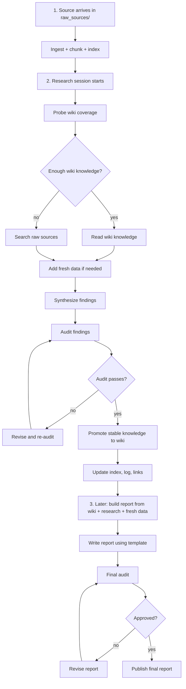
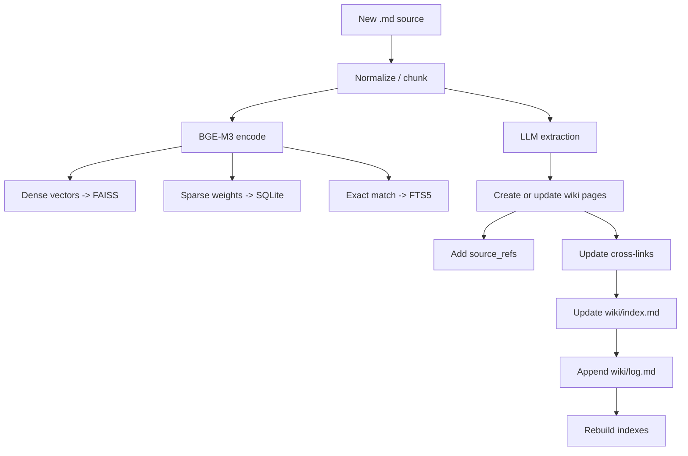
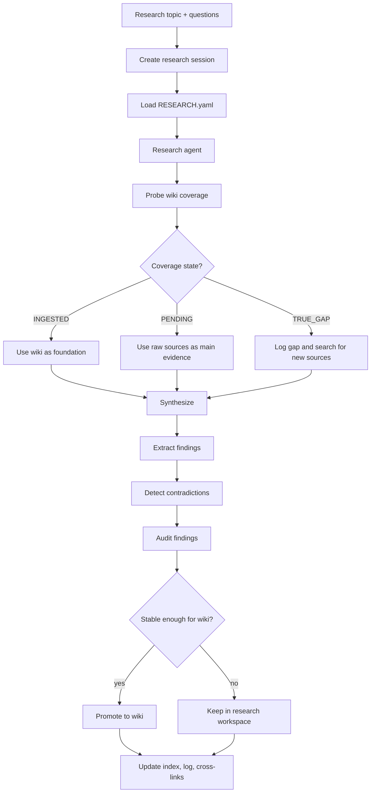
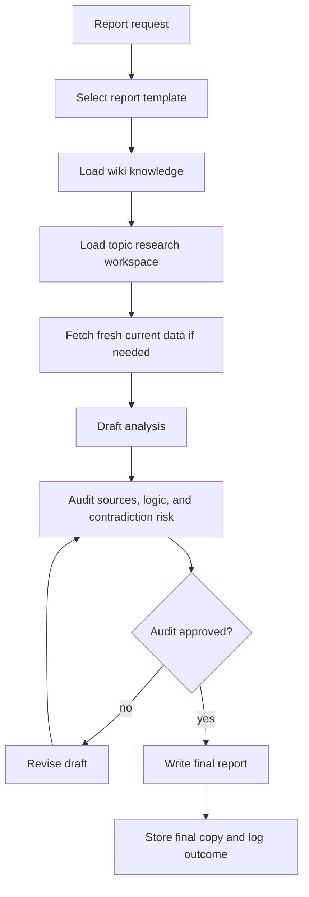
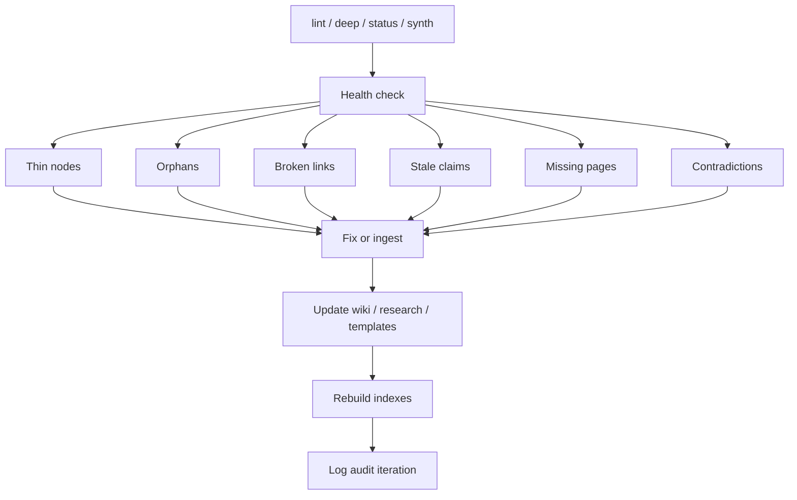

# BGE-M3 System Workflow

This document is the updated operating workflow for the repository.
It is the living system blueprint, updated from the original BGE-M3 design
to support research, analysis, reporting, and audit as a single workflow.

Read `CLAUDE.md` first. It is the root operating manual.

---

## 1. System Goal

Build a bilingual economic research operating system that:
- stores immutable raw sources
- compiles durable wiki knowledge
- maintains topic-scoped research workspaces
- generates audited reports
- uses BGE-M3 as the retrieval backbone
- supports macroeconomics, fiscal policy, monetary policy, Basel / capital
  constraints, and broader finance / economics work

---

## 2. Root Structure

```text
economic-research-wiki/
├── CLAUDE.md                            # Root operating manual
├── README.md                            # Human-facing overview
├── raw_sources/                         # Immutable raw inputs
├── wiki/                                # Mutable compiled knowledge
├── research/                            # Topic workspaces
├── templates/                           # Analysis frameworks
├── scripts/                             # Agents and orchestration
├── config/                              # Schema and runtime rules
├── data/                                # Session and audit state
├── .cache/                              # Rebuildable indexes
└── graphify-out/                        # Graph expansion data
```

---

## 3. Information Layers

### 3.1 raw_sources/

Immutable source documents:
- books
- papers
- reports
- clipping
- academic notes

### 3.2 wiki/

Durable compiled knowledge:
- concepts
- entities
- frameworks
- indicators
- policies
- synthesis
- contradictions
- index.md
- log.md
- _metadata/

### 3.3 research/

Topic-scoped working memory:
- RESEARCH.yaml
- findings/
- data/
- drafts/
- final/
- audit_log.json

### 3.4 templates/

Reusable analysis structures:
- monetary policy templates
- fiscal policy templates
- Basel / risk templates
- macro outlook templates
- financial markets templates
- schema definitions

---

## 4. Operating Doctrine

1. Read the source before writing the wiki.
2. Distinguish durable knowledge from transient findings.
3. Use the wiki as the memory layer for future work.
4. Use research workspaces for current investigations.
5. Audit before publishing a report.
6. Treat contradictions as first-class outcomes.
7. Promote only stable conclusions into the wiki.
8. Rebuild indexes after wiki changes.

---

## 5. End-to-End Lifecycle



---

## 6. Ingest Flow

Purpose:
- convert a new `.md` source into durable knowledge



Ingest rules:
- source_refs are mandatory for durable pages
- confidence must reflect evidence quality
- update backlinks when a page changes
- rebuild indexes after wiki changes

Ingest outputs:
- concept pages
- mechanism pages
- entity pages
- framework pages
- policy pages
- synthesis pages
- contradiction pages

---

## 7. Research Flow

Purpose:
- answer a research question and turn the result into reusable knowledge



Research outputs:
- short findings
- evidence notes
- working drafts
- final internal memo
- stable wiki pages

Research rules:
- theory comes from the wiki
- topic evidence comes from raw sources
- current data can be fetched from web when needed
- unstable claims stay in research until audited

---

## 8. Report Flow

Purpose:
- produce a final analysis or memo in a chosen style



Report rules:
- do not write a final report from raw sources alone if the wiki already exists
- use current data to refresh stale or time-sensitive claims
- audit before final publication
- store final results back into the repo for future use

---

## 9. Audit Flow

Purpose:
- keep the wiki healthy and prevent drift



Audit outputs:
- fix request
- ingest request
- wiki update request
- contradiction node request
- report revision request

---

## 10. Retrieval Stack

- BGE-M3 daemon
- dense FAISS index
- sparse SQLite index
- FTS5 exact-match index
- reranker

Search rules:
- probe first, search second
- Vietnamese queries are augmented with the bilingual dictionary
- `INGESTED` queries search `wiki/`
- `PENDING` queries search `raw_sources/`
- `TRUE_GAP` queries stop and are logged

---

## 11. Template System

The template system should be layered.

### 11.1 Core templates

Use these for all topics:
- `question_analysis.yaml`
- `evidence_extraction.yaml`
- `audit_checklist.yaml`
- `report_outline.yaml`

### 11.2 Domain templates

Use these for major topic families:
- `monetary_policy/`
- `fiscal_policy/`
- `basel_risk/`
- `macro_outlook/`
- `financial_markets/`

Example domain templates:
- policy stance analysis
- transmission mechanism review
- inflation targeting assessment
- fiscal sustainability analysis
- Basel capital constraint analysis
- liquidity and funding stress review

### 11.3 Output style templates

Use these for final deliverables:
- policy note
- research memo
- executive brief
- scenario analysis
- audit memo
- technical report

### 11.4 What a template should contain

Every template should define:
- objective
- key questions
- required evidence
- preferred sources
- audit criteria
- output structure
- style / tone
- expected deliverable format

---

## 12. Knowledge Promotion Rules

Not everything should move into the wiki.

Promotion levels:

1. Temporary note
2. Research finding
3. Stable wiki knowledge

Promotion criteria:
- supported by reliable sources
- internally consistent
- not contradicted by fresher evidence
- reusable beyond the current topic
- clear enough to become a durable page

If a finding is time-sensitive or uncertain:
- keep it in `research/<topic>/`
- do not promote yet

---

## 13. Recommended Operating Cycle

1. Add new raw source files.
2. Ingest the source into the wiki system.
3. Research one topic at a time.
4. Promote stable knowledge into the wiki.
5. Create a report when needed.
6. Audit the result.
7. Refresh the wiki when new data arrives.
8. Repeat.

---

## 14. Design Goal

The target is a compounding knowledge system:
- each source improves the wiki
- each research session improves future research
- each report can be reused later
- each audit reduces drift
- each template makes the next analysis faster and more consistent

